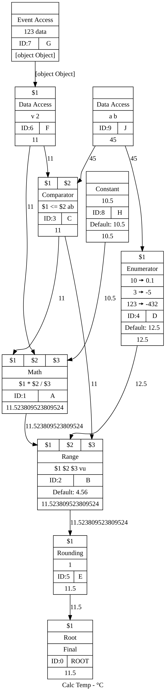

# dag-solve

[](https://travis-ci.org/gumm/dag-solve)

Directed acyclic graph (DAG) based solver.
The graphs built here always has a single root node, and this root node,
can only ever have one in degree and my not have out degrees. Below the root
node no further restrictions apply save for the prevention of cycles.

Each node created in the graph can be configured to be a:
* math solver
* an enum solver
* a comparator (equality, identity, inequality, 
               non-identity, bigger-than, smaller-than, 
               bigger-or-equal, smaller-or-equal)
* a band-pass filter (check that a number is between two stops)               
* a number rounder
* a data reader

The graph can be serialised to JSON and deserialised back into a DAG object.
The graph has a "solve" method that solves the graph.
The graph can return a stand-alone solver function that can be applied to
large data sets.

## Declare a graph
```javascript
const DAG = require('dag-solve');

// Declare the graph
const g = new DAG();

// Add named nodes
const A = g.makeNode('A');
const B = g.makeNode('B');
const C = g.makeNode('C');
const D = g.makeNode('D');

// Connect the nodes
// Read connect A to B
g.connect(A, g.root)
  .connect(B, A)
  .connect(C, A)
  .connect(C, B)
  .connect(D, C);

g.root;     // The root node. Auto created and can not be 
            // deleted from the graph.

g.graph;      // The graph as a Map of Nodes to a Set of Nodes

g.nodes;      // An array of nodes in order of insertion

g.topo;       // A topo sorted array of nodes

g.ids;        // An array of node ids in order of insertion
              // [ 0, 1, 2, 3, 4 ]

g.topoIds;    // An array of node ids in topo order
              // [ 4, 3, 2, 1, 0 ]

g.names;      // An array of node names in order of insertion
              // [ 'D', 'C', 'B', 'A', 'ROOT' ]
            
g.topoNames;  // An array of node names in order of insertion
              // [ 'ROOT', 'A', 'B', 'C', 'D' ]

g.leafs;      // An array of leaf nodes. Nodes without any 
              // in-degrees

g.orphans;    // An array of nodes without out-degrees. 
              // Excludes the root node

// Getter and setter methods are available to store human readable
// stuff about the graph

g.description = 'Calculates temp';
g.description; // 'Calculates temp'

g.units = '°C';
g.units; // '°C';

g.ref = 123;
g.ref; // 123

// Note: meta is not dumped or restored via the dump/read cycle.
// It is intended for as an in-memory placeholder if needed.
g.meta = {'Anything': ['goes']};
g.meta; // { Anything: [ 'goes' ] }


```
## Structure the graph
```javascript
// A simple 4 node graph.
// C ---→ B ---→ A --→ root
const g = new DAG();
const A = g.makeNode('A');
const B = g.makeNode('B');
const C = g.makeNode('C');
g.connect(C, B).connect(B, A).connect(A, g.root);

g.leafs; // [ C ]

g.orphans; // []

// Disconnect nodes
g.disconnect(B, A);   // Read disconnect B from A
g.leafs;              // [ A, C ] The don't have in degrees
g.orphans;            // [ B ] It has no out degree.

// Who is connected to B?
g.indegrees(B);       // [ C ] remains connected even 
                      // if B is orphaned.

// Is B really not connected to anything?
g.outdegrees(B);      // [] Yep. No out degrees.

// So lets delete B from the graph.
let b = g.delNode(B); // b === true. Node B is not part of 
                      // the graph any more

// Oh no! Wait, we need it back.
b = g.addNode(B);     // b === B. The B node is added back
                      // B remains disconnected

// By now, B, and C are orphaned, 
// and B, C, and A are all leaf nodes.
g.orphans;            // [ C, B ] Note the order of insertion
g.leafs;              // [ A, C, B ]

// Lets just clean the graph. Delete all orphans.
g.clean();            // Recursively deletes all the orphan nodes.
g.nodes;              // [ root, A ]
g.orphans;            // []
g.leafs;              // [ A ]
```
## Nodes can do things
```javascript
const DAG = require('dag-solve');
g = new DAG();
g.description = 'Calc Temp';
g.units = '°C';
g.ref = 123;
const A = g.makeNode('A').setMath('$1 * $2 / $3');
const B = g.makeNode('B').setBetween('$1', '$2', '$3', 'vu').setFallback(4.56);
const C = g.makeNode('C').setComparator('$1', '<=', '$2', 'ab');
const D = g.makeNode('D')
    .addEnum(10, 0.1)
    .addEnum(3, -5)
    .addEnum(123, -432)
    .setFallback(12.5)
const E = g.makeNode('E').setRound(1);
const F = g.makeNode('F').setPath('v', 2);
const G = g.makeNode('G').setEvCode(123, 'data');
const H = g.makeNode('H').setFallback(10.5);
const J = g.makeNode('J').setPath('a', 'b');

g.connect(G, F);    // In F: G is $1
g.connect(J, D);    // In F: J is $1
g.connect(A, B);    // In B: A is $1
g.connect(D, B);    // In B: D is $2
g.connect(C, B);    // In B: C is $3
g.connect(C, A);    // In A: C is $1
g.connect(F, C);    // In C: F is $1
g.connect(F, A);    // In A: F is $2
g.connect(J, C);    // In C: J is $2
g.connect(H, A);    // In A: H is $3
g.connect(B, E);    // In E: B is $1
g.connect(E, g.root);

// Lests just declare some date we want to operate on:
let event = {'123':{data:{v:[33,22,11]}}}
let data = {_ev:event, a:{b:45}}

// Solve with the data.
g.solve();    // undefined
g.solve(data) // 11.5

// What happened at each step?
g.debug(data);  // Map {
                //   'topoIds' => [ 9, 4, 8, 7, 6, 3, 1, 2, 5, 0 ],
                //   'data' => { _ev: { '123': [Object] }, a: { b: 45 } },
                //   9 => 45,
                //   4 => 12.5,
                //   8 => 10.5,
                //   7 => { v: [ 33, 22, 11 ] },
                //   6 => 11,
                //   3 => 11,
                //   1 => 11.523809523809524,
                //   2 => 11.523809523809524,
                //   5 => 11.5,
                //   0 => 11.5,
                //   'topoNames' => [ 'J', 'D', 'H', 'G', 'F', 'C', 'A', 'B', 'E', 'ROOT' ] }

```
# Use the solver
Using the exact graph as above, we can get a solver function that can
be applied to an array of values.
```javascript
// Previously we used the the graph directly to solve.
// But we can get a solver from the graph that has done some pre-processing
// in it's setup. Using this solver is much more efficient than solving
// the graph directly.
// Now get a standalone solver function from the graph
const s = g.getSolver();
s(data) // 11.5

// Solve multiple data points.
[d1, d2, d3].map(s); // [ 4.6, 11.5, 22.9 ... ]
```
A note on the solver function: It is divorced from the graph, and changes
to the graph won't be propagated to the solver function. If the graph
changes, (either in structure, or in the set-up of any of its nodes) the
solver function needs to be replaced.

# Serialise and restore a graph via JSON
Once a graph is configured it can be dumped to JSON for storage, and read
back when needed. Using the above graph:
```javascript
const json = g.dump();
```
which produces this JSON...
```json
{
  "M": ["Calc Temp","°C",123],
  "G": [
    [0,[]],
    [1,[2]],
    [2,[5]],
    [3,[2,1]],
    [4,[2]],
    [5,[0]],
    [6,[3,1]],
    [7,[6]],
    [8,[1]],
    [9,[4,3]]
  ],
  "N":[
    {"A":[],"B":[],"C":[],"E":[],"I":9,"N":"J","P":["a","b"],"V":[]},
    {"A":[9],"B":[],"C":[],"D":12.5,"E":[[10,0.1],[3,-5],[123,-432]],"I":4,"N":"D","P":[],"V":[]},
    {"A":[],"B":[],"C":[],"D":10.5,"E":[],"I":8,"N":"H","P":[],"V":[]},
    {"A":[],"B":[],"C":[],"E":[],"I":7,"N":"G","P":[],"V":[123,"data"]},
    {"A":[7],"B":[],"C":[],"E":[],"I":6,"N":"F","P":["v",2],"V":[]},
    {"A":[6,9],"B":[],"C":["$1","<=","$2","ab"],"E":[],"I":3,"N":"C","P":[],"V":[]},
    {"A":[3,6,8],"B":[],"C":[],"E":[],"I":1,"M":"$1 * $2 / $3","N":"A","P":[],"V":[]},
    {"A":[1,4,3],"B":["$1","$2","$3","vu"],"C":[],"D":4.56,"E":[],"I":2,"N":"B","P":[],"V":[]},
    {"A":[2],"B":[],"C":[],"E":[],"I":5,"N":"E","P":[],"R":1,"V":[]},
    {"A":[5],"B":[],"C":[],"E":[],"I":0,"M":"$1","N":"ROOT","P":[],"V":[]}
  ]
}
```
which can be read back into a new graph...
```javascript

g2 = DAG.read(json)   // A static method to create a DAG from an object;
g2.solve(data);       // 11.5
g2 === g;             // False

```

# Dump a graph to GraphViz DOT format file
```javascript
var fs = require('fs');
const write = s => fs.writeFile("dot.txt", s, err => console.log(err ? err : 'OK'));
write(g2.dotPlot());
```
Optionally pass in data to see the calculation results at each step.
```javascript
write(g2.dotPlot());
```
```
digraph { 
    node [shape=record]; 
    label = "Calc Temp - °C"; 
    
    0 [label="{{<5>$1}|Root|Final|{ID:0|ROOT}|11.5}"]; 
    1 [label="{{<3>$1|<6>$2|<8>$3}|Math|$1 * $2 / $3|{ID:1|A}|11.523809523809524}"]; 
    2 [label="{{<1>$1|<4>$2|<3>$3}|Range|$1 $2 $3 vu|{ID:2|B}|Default: 4.56|11.523809523809524}"]; 
    3 [label="{{<6>$1|<9>$2}|Comparator|$1 \<= $2 ab|{ID:3|C}|11}"]; 
    4 [label="{{<9>$1}|Enumerator|{10 🠚 0.1}|{3 🠚 -5}|{123 🠚 -432}|{ID:4|D}|Default: 12.5|12.5}"]; 
    5 [label="{{<2>$1}|Rounding|1|{ID:5|E}|11.5}"]; 
    6 [label="{{<7>$1}|Data Access|v 2|{ID:6|F}|11}"]; 
    7 [label="{{}|Event Access|123 data|{ID:7|G}|[object Object]}"]; 
    8 [label="{{}|Constant|10.5|{ID:8|H}|Default: 10.5|10.5}"]; 
    9 [label="{{}|Data Access|a b|{ID:9|J}|45}"];  
    
    1 -> 2:1[label="11.523809523809524"]; 
    2 -> 5:2[label="11.523809523809524"]; 
    3 -> 2:3[label="11"]; 
    3 -> 1:3[label="11"]; 
    4 -> 2:4[label="12.5"]; 
    5 -> 0:5[label="11.5"]; 
    6 -> 3:6[label="11"]; 
    6 -> 1:6[label="11"]; 
    7 -> 6:7[label="[object Object]"]; 
    8 -> 1:8[label="10.5"]; 
    9 -> 4:9[label="45"]; 
    9 -> 3:9[label="45"]; }
```
These DOT-file strings can be used to visualize the graph.
See for instance tools like: http://www.webgraphviz.com/ or http://viz-js.com/

[](img/dot.png)


